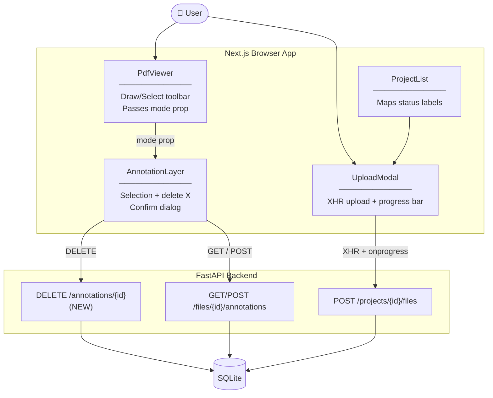

## Context

Three UX gaps exist in the current tool:

1. `UploadModal` uses `fetch` which emits no progress events — users see only a text label change during upload.
2. `ProjectList` displays `f.status` raw from the backend; backend always sets `status=pending` on insert and never updates it, so every file shows "Pending" forever.
3. `AnnotationLayer` renders placed rects with no selection or deletion mechanism — mistakes require a page reload.

In-force ADRs constraining this design:
- **ADR-0003**: Backend owns all file serving — frontend uses file IDs only.
- **ADR-0005**: react-pdf / pdfjs-dist for PDF rendering; SVG overlay positioned over canvas.
- **ADR-0006**: Annotation coordinates stored in PDF point space; conversion happens at draw time in frontend.
- **ADR-0001**: SQLite via stdlib `sqlite3`, no ORM.

## Goals / Non-Goals

**Goals:**
- Show aggregate upload percentage progress bar in `UploadModal` during file transfer.
- Map `status: "pending"` → label `"Uploaded"` in the file table; no backend change required.
- Add Draw/Select mode toolbar to `PdfViewer` controls bar.
- In Select mode: clicking a rect highlights it and shows a delete button; confirmation dialog required before deletion.
- `DELETE /annotations/{annotation_id}` backend endpoint removes the annotation row.

**Non-Goals:**
- Per-file progress bars (single batch upload only).
- Annotation resize handles (deferred).
- Annotation ownership / auth checks (single-user tool).
- Real file processing pipeline to update `status` beyond the label fix.

## Decisions

### D1 — Replace `fetch` with `XMLHttpRequest` in `UploadModal`

`fetch` provides no upload progress API. `XMLHttpRequest.upload.onprogress` fires with `loaded` and `total` byte counts. FastAPI includes `Content-Length` on multipart responses so `total` is always available — percentage is safe.

**Alternative considered:** chunked upload with streaming. Rejected — unnecessary complexity for local single-user tool; XHR swap is minimal change.

### D2 — Status label mapping in frontend only

`FILE_TYPE_LABELS`-style map: `{ pending: "Uploaded" }`. No backend migration, no schema change. Future processing pipeline can introduce real statuses (`processing`, `ready`, `failed`) and the frontend map extends naturally.

**Alternative considered:** rename column or add a new status value in DB. Rejected — the status field is not meaningless, it correctly reflects that no processing has run; the display label is the problem, not the data.

### D3 — Draw/Select toolbar as mode prop through `PdfViewer` → `AnnotationLayer`

`PdfViewer` holds `mode: "draw" | "select"` state. Toolbar renders in the existing controls bar. Mode prop flows down to `AnnotationLayer`. This keeps `AnnotationLayer` as a pure rendering/interaction component with no toolbar UI of its own.

**Alternative considered:** toolbar inside `AnnotationLayer`. Rejected — `AnnotationLayer` is scoped to SVG overlay; toolbar belongs in the viewer chrome.

### D4 — Confirmation dialog before annotation delete

On X click in Select mode, a browser `confirm()` dialog gates the `DELETE` call. Prevents accidental one-click deletion. No ownership check required (single-user).

**Alternative considered:** undo mechanism. Rejected — out of scope; confirm dialog is sufficient for now.

### D5 — `DELETE /annotations/{annotation_id}` endpoint

Simple `DELETE WHERE id = ?` against the `annotations` table. Returns `204 No Content` on success, `404` if id not found. Consistent with existing REST pattern in `main.py`.

## Component Diagram



## Dynamic Flows

**Upload with progress:**
```
User → UploadModal: select files, click Upload
UploadModal → XHR: open + send(FormData)
loop onprogress
  XHR → UploadModal: loaded / total → render % bar
XHR → UploadModal: onload 201 → close modal
```

**Annotation select + delete:**
```
User → PdfViewer: click Select tool → mode = "select"
User → AnnotationLayer: click rect → highlight + show X
User → AnnotationLayer: click X → confirm() dialog
User confirms → AnnotationLayer → DELETE /annotations/{id}
Backend → SQLite: DELETE WHERE id = ?
AnnotationLayer: remove rect from local state
```

## Risks / Trade-offs

- **XHR `total = 0` risk** → FastAPI includes `Content-Length` on multipart; verified safe. If ever proxied behind nginx with `Content-Length` stripped, bar would show 0% — mitigated by falling back to indeterminate bar when `total === 0`.
- **Stale selection on page change** → If user switches PDF page while a rect is selected in Select mode, selection state must reset. `AnnotationLayer` re-mounts per page change (keyed by `page` prop), so this is automatic.
- **`confirm()` blocks main thread** → Acceptable for single-user local tool. Replace with modal dialog if polish is needed later.

## Migration Plan

- No database schema changes required.
- `DELETE /annotations/{id}` is additive — no existing endpoints change.
- Frontend label map is additive — existing `status` values unaffected.
- No environment variable changes.
- Rollback: revert frontend files + remove the new backend endpoint.

## Open Questions

- None blocking implementation.
- Future: if a processing pipeline is added that sets `status` to values other than `pending`, the frontend label map will need extending. Flag this when the pipeline change is proposed.
