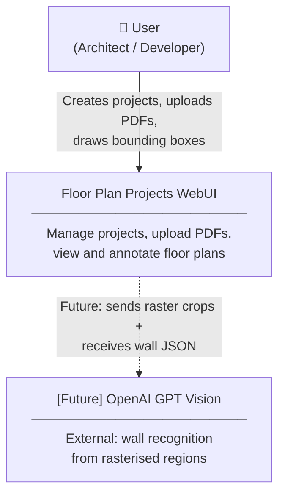
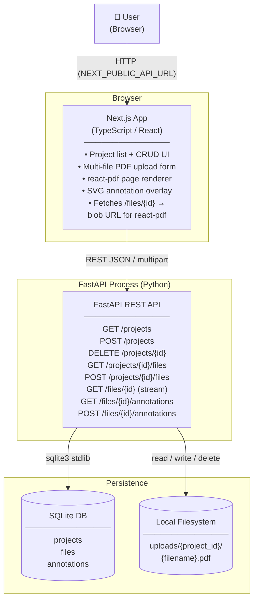

## Context

WebUI is unusable on dark-OS systems (dark media query overrides all colours). The application has no way to create or delete projects, upload files, or view/annotate PDFs. These are blockers to the planned floor-plan annotation pipeline (bounding box → PyMuPDF extraction → GPT vision → wall reconstruction).

Existing ADRs in force:
- **ADR-0001**: SQLite via stdlib `sqlite3`, no ORM
- **ADR-0002**: Per-project file layout `uploads/{project_id}/{filename}`, relative paths in DB
- **ADR-0003**: Backend owns all file serving; frontend creates blob URL from `GET /files/{id}` bytes
- **ADR-0004**: Separate `.env` files per process

## Goals / Non-Goals

**Goals:**
- Force always-light theme (remove dark-mode media query overrides)
- Create and delete projects (cascade: DB rows + disk files + annotations)
- Upload multiple PDFs per project (PDF-only, validated both sides)
- View PDFs in-browser using `react-pdf` with page navigation and zoom
- Draw rectangular bounding boxes on PDF pages and persist coordinates

**Non-Goals:**
- PDF content extraction (text, vectors, raster crops) — future change
- OpenAI GPT vision integration — future change
- Authentication / multi-user access
- Dark mode toggle / user theme preference

## Decisions

### D1: Force always-light by removing dark media queries

Remove both `@media (prefers-color-scheme: dark)` blocks from `globals.css` and `page.module.css`. No CSS variable toggle, no `data-theme` attribute, no `next-themes`. Simplest path; revisit when theme switcher is needed.

**Alternative rejected:** Keep system preference adaptive — user explicitly requested fixed light mode.

---

### D2: PDF viewer — `react-pdf` with blob URL (ADR-0003 compliant)

Frontend fetches `GET /files/{id}` → `response.arrayBuffer()` → `URL.createObjectURL(blob)` → passes blob URL to `<Document>` from `react-pdf`. This satisfies ADR-0003 (frontend never holds a file path or static URL).

`react-pdf` renders each page to `<canvas>` via pdfjs-dist. SVG annotation overlay sits absolutely positioned above each canvas at identical dimensions.

**Alternative rejected:** `<iframe src="/files/{id}">` — browser PDF viewer, no canvas access, cannot overlay interactive SVG layer.

---

### D3: Annotation coordinates stored in PDF points (not screen pixels)

`annotations` table stores `(x0, y0, x1, y1)` in PDF coordinate space (points, origin bottom-left per PDF spec). Frontend converts screen-space mouse events to PDF-space using page dimensions from `react-pdf`'s `onPageLoadSuccess` callback. Stored coordinates are resolution- and zoom-independent and can be passed directly to PyMuPDF `fitz.Rect` in future extraction step.

**Alternative rejected:** Screen pixels — breaks on zoom, DPI changes, and server-side extraction.

---

### D4: Filename collision — reject with 409

`POST /projects/{id}/files` checks for an existing `files` row with matching `filename` and `project_id`. If found, return HTTP 409 Conflict. User must delete the file first before re-uploading. No silent overwrite, no rename suffix.

Consistent with ADR-0002's deferred collision note: explicit rejection is the simplest safe default.

---

### D5: Cascade delete implementation

`DELETE /projects/{id}` executes in this order:
1. Fetch all `files.filepath` for the project.
2. Delete `annotations` rows for those file IDs.
3. Delete `files` rows for the project.
4. Delete the `projects` row.
5. `shutil.rmtree(uploads/{project_id}/)` — remove directory from disk.

SQLite FK cascade is not relied upon (FK enforcement requires `PRAGMA foreign_keys = ON` per connection; not currently set). Explicit ordered deletes are used instead.

---

### D6: Backend CORS expansion

`CORSMiddleware` currently sets `allow_methods=["GET"]`. Change to `allow_methods=["GET", "POST", "DELETE"]`. No other CORS changes.

---

## C4 — System Context

## C4 — Container

## Risks / Trade-offs

- **PDF bytes proxy overhead** → FastAPI streams all PDF traffic. For large floor plan files this is a bottleneck. Mitigation: deferred; acceptable for single-user local dev (ADR-0001 context).
- **No FK enforcement in SQLite** → cascade delete is manual; a bug leaves orphan rows. Mitigation: explicit ordered deletes in a single function, unit-testable.
- **pdfjs-dist worker config in Next.js** → pdfjs-dist requires a web worker; Next.js App Router needs `workerSrc` set to the correct public path. Mitigation: copy worker file to `public/` and configure `pdfjs.GlobalWorkerOptions.workerSrc` in a client component.
- **PDF coordinate origin** → PDF spec uses bottom-left origin; screen/SVG use top-left. Frontend must flip Y axis when converting mouse coords to PDF space. Mitigation: document the transform in `AnnotationLayer.tsx`.

## Migration Plan

1. Run `pip install python-multipart` (required for FastAPI file upload).
2. Run `npm install react-pdf` in `frontend/`.
3. Backend `init_db()` adds `annotations` table via `CREATE TABLE IF NOT EXISTS` — safe on existing DB, no data loss.
4. No seed data changes needed.
5. Rollback: revert code; `annotations` table is additive and does not affect existing queries.

## Open Questions

- None. All questions resolved during design grilling session.
