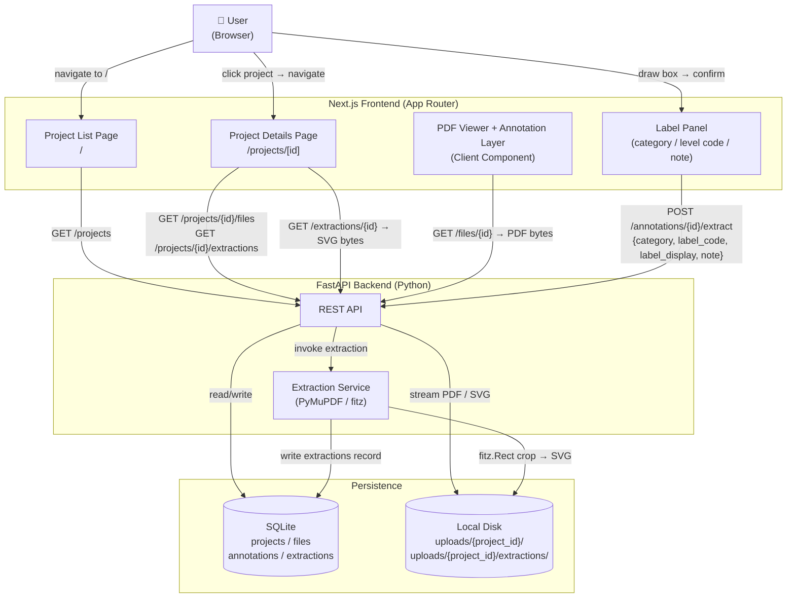

## Context

The system has a working annotation pipeline: users draw bounding boxes on PDF pages, coordinates are stored in PDF point space (ADR-0006), and the backend owns all file serving (ADR-0003). Annotations are currently draw-only markers — they carry no semantic label and produce no extracted output.

This change adds the next layer: a confirm step that attaches classification metadata to a drawn box, triggers synchronous SVG extraction via PyMuPDF, persists the result, and surfaces it on a new Project Details page.



## Goals / Non-Goals

**Goals:**
- Confirm-and-extract pipeline: draw → label (category + level code + optional display name + note) → confirm → backend SVG extraction → stored result
- `extractions` table as canonical record of all processed outputs linked to annotations
- SVG extraction using PyMuPDF with Y-axis coordinate conversion: annotation coords are in PDF user space (origin bottom-left, y upward); fitz device space has origin top-left with y downward, so `device_y = page_height − pdf_y` before constructing `fitz.Rect`
- Project Details page at `/projects/[id]` showing uploaded documents and extracted SVGs grouped by file
- Project list items navigate to details page (replaces inline file expansion)
- Floor plan level code system: fixed enum `B01, L00, L01, L02, L03, L04, L05`; optional display name alongside code

**Non-Goals:**
- PNG extraction or tiling (future change — requires separate tiling pipeline)
- Async/queued extraction (synchronous PyMuPDF crop is fast enough for single-region clips)
- LLM processing of extracted regions (future change)
- Auth, multi-user, or cloud storage
- Editing or re-extracting a confirmed annotation (delete and redraw instead)

## Decisions

### 1. PyMuPDF for SVG extraction

**Decision:** Use `pymupdf` (`fitz`) to crop the annotated region and export SVG via `tmp_page.show_pdf_page(clip=...)` + `tmp_page.get_svg_image()`. Annotation coordinates (PDF user space: origin bottom-left, y upward) must be converted to fitz device space (origin top-left, y downward) before constructing the clip rect: `device_y0 = page_height − pdf_y1`, `device_y1 = page_height − pdf_y0`.

**Rationale:** ADR-0006 stores annotation coordinates in PDF point space (origin bottom-left, y upward). fitz device space has origin top-left with y downward — the two coordinate systems share units (points) but differ in y-axis direction, requiring an explicit flip at extraction time. PyMuPDF produces native vector SVG output preserving lines, curves, and text from technical drawings. No other Python library offers this without a subprocess call to external tools.

**Alternative considered:** `pdf2svg` / `pdfcairo` subprocess — rejected: requires external system binary, adds OS-level dependency, harder to install cross-platform.

### 2. Separate `extractions` table (not extending `annotations`)

**Decision:** New table:
```sql
CREATE TABLE extractions (
    id              INTEGER PRIMARY KEY AUTOINCREMENT,
    annotation_id   INTEGER NOT NULL REFERENCES annotations(id),
    category        TEXT NOT NULL,       -- 'floor-plan' | 'elevation' | 'cross-section' | 'specification' | 'schedule' | 'other'
    label_code      TEXT NOT NULL,       -- 'L00', 'B01', free text for other categories
    label_display   TEXT,               -- optional human name, e.g. 'Ground Floor / Lobby'
    note            TEXT,               -- optional free text
    svg_path        TEXT NOT NULL,       -- relative: '{project_id}/extractions/{annotation_id}.svg'
    status          TEXT DEFAULT 'pending',  -- 'pending' | 'done' | 'failed'
    extracted_at    TEXT,
    created_at      TEXT DEFAULT (datetime('now'))
);
```

**Rationale:** An annotation is raw geometry (where the user drew). An extraction is a confirmed, processed output with semantic metadata. Separating them keeps annotation coordinates clean for future uses (measurements, overlays) independent of extraction state. Future PNG outputs, retries, or multiple extraction formats can be added as new rows without altering the annotations table.

**Alternative considered:** Adding columns to `annotations` — rejected: conflates two concerns, makes it impossible to have unextracted annotations cleanly, blocks future multi-format outputs.

### 3. SVG storage under `uploads/{project_id}/extractions/`

**Decision:** Extend ADR-0002's per-project layout. SVGs stored at `uploads/{project_id}/extractions/{annotation_id}.svg`. `extractions.svg_path` stores relative path `{project_id}/extractions/{annotation_id}.svg`.

**Rationale:** Consistent with existing file layout. Per-project deletion cascade already removes `uploads/{project_id}/` — extracted SVGs are cleaned up automatically. No new storage configuration needed.

### 4. Backend streams SVGs via `GET /extractions/{id}` (extends ADR-0003)

**Decision:** Frontend never holds SVG file paths. New endpoint `GET /extractions/{id}` reads `svg_path` from DB, streams SVG bytes with `Content-Type: image/svg+xml`. Same pattern as `GET /files/{id}` for PDFs.

**Rationale:** ADR-0003 mandates backend-owns-file-serving. SVGs are derived outputs stored on disk — same rule applies. Keeps storage layout opaque to frontend.

### 5. Synchronous extraction on `POST /annotations/{id}/extract`

**Decision:** Extraction runs synchronously within the request handler. Response returns the created extraction record including `id` and `status: done`.

**Rationale:** PyMuPDF single-region crop + SVG export is fast (typically <100ms for a region of a technical drawing). No job queue complexity needed at this scale. If a crop fails, the endpoint returns HTTP 500 and no extraction record is written.

### 6. Post-draw inline label panel (not a modal)

**Decision:** After a bounding box is placed, an inline panel appears overlaid at the edge of the drawn rect (or below the toolbar). Panel contains: category dropdown, conditional level code dropdown (floor-plan only), optional display name text input, optional note textarea, Confirm and Cancel buttons.

**Rationale:** Keeps the user in context on the PDF page. A modal would obscure the drawn region, making it hard to verify the selection before confirming. Cancel discards the drawn annotation (DELETE to backend). Confirm triggers extraction.

### 7. `/projects/[id]` Next.js App Router dynamic route

**Decision:** New file at `frontend/src/app/projects/[id]/page.tsx`. Server component fetches project details + files + extractions. Project list items (`ProjectList`) become `<Link href="/projects/{id}">` instead of inline-expand triggers.

**Rationale:** Clean routing separation. Project list stays lightweight. Details page owns the document/extraction display concern. Browser back button works naturally.

## Risks / Trade-offs

| Risk | Mitigation |
|---|---|
| PyMuPDF SVG quality varies by PDF — some PDFs produce malformed or enormous SVG output | Limit SVG file size (reject if > 10MB); log failures as status `failed` in extractions table; user can retry by deleting and redrawing |
| Inline label panel UI complexity on small PDF viewports | Panel positioned relative to viewport, not the rect — falls back to fixed position if rect is near edge |
| Extraction is synchronous — slow on very large PDFs | Acceptable at this stage; async queue is a known future upgrade path |
| Per-project delete cascade must also remove `extractions/` subdirectory | `shutil.rmtree(uploads/{project_id}/)` already covers subdirectories — no extra code needed |
| Floor plan level enum hardcoded B01–L05 may be too narrow for some projects | `label_display` free text field covers edge cases; enum can be extended in a future change |

## Migration Plan

1. On backend startup, `init_db()` runs `CREATE TABLE IF NOT EXISTS extractions (...)` — no data migration needed, existing annotations are unaffected.
2. `uploads/{project_id}/extractions/` directories are created on first extraction for each project — no pre-creation needed.
3. Frontend: `ProjectList` click handler changes from inline-expand to `router.push('/projects/{id}')` — existing project list behaviour is replaced, not extended.
4. No rollback complexity — `extractions` table can be dropped, `ProjectList` reverted independently.

## Open Questions

None. All architectural decisions resolved through the proposal grilling session. The following ADRs will be recorded to capture new decisions made in this change:
- PyMuPDF as the extraction library
- Separate `extractions` table design
- SVG-first extraction format (PNG deferred)
- Fixed floor plan level code enum
